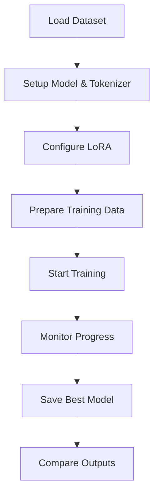

# 🦙 TinyLlama Fine-Tuning Pipeline


**Fine-tune TinyLlama for Python docstring generation with LoRA and 4-bit quantization**

[Installation](#installation) • [Usage](#usage) • [Architecture](#architecture)

---

## Overview

Fine tune TinyLlama-1.1B to write docstrings for Python functions.

### Key Components

- **Parameter-Efficient Fine-tuning** with LoRA and 4-bit quantization for memory-efficient training
- **Real-time Monitoring** with custom callbacks for gradient tracking and NaN detection  
- **Production-Ready Web Interface** with Flask app for live model comparison
- **Optimized Training** with gradient accumulation, mixed precision, and efficient data loading

---

## Installation

### Prerequisites

- **CUDA-compatible GPU** (recommended: 8GB+ VRAM)
- **Python 3.10+**
- **Conda/Miniconda**

### Quick Setup

```bash
# Clone the repository
git clone https://github.com/yourusername/tinyllama-finetune.git
cd tinyllama-finetune

# Create and activate conda environment
conda env create -f environment.yml
conda activate llama-finetune

# Verify CUDA availability
python -c "import torch; print(f'CUDA available: {torch.cuda.is_available()}')"
```

### Environment Details

The `environment.yml` includes all necessary dependencies:

- **PyTorch 2.2.0** with CUDA 11.8 support
- **Transformers 4.36+** for model handling
- **PEFT 0.7+** for LoRA implementation
- **BitsAndBytes 0.41+** for quantization
- **Unsloth** for optimized training
- **Flask** for web interface

---

## Usage

### 1. Add or modify training data [Optional]

Add your training examples to `data/docstring_dataset.py`:

```python
DOCSTRING_EXAMPLES = [
    {
        "instruction": "def calculate_area(radius):\n    return 3.14159 * radius ** 2",
        "response": '"""Calculate the area of a circle.\n\nArgs:\n    radius: The radius of the circle\n\nReturns:\n    float: The area of the circle\n"""'
    },
    # Add more examples...
]
```

### 2. Configure Training

Modify settings in `src/config.py`:

```python
@dataclass
class TrainingConfig:
    # Model settings
    model_path: str = "TinyLlama/TinyLlama-1.1B-Chat-v1.0"
    output_dir: str = "./tiny_llama_finetuned"
    
    # Training hyperparameters
    num_epochs: int = 10
    batch_size: int = 4
    gradient_accumulation_steps: int = 8
    learning_rate: float = 1e-5
    
    # LoRA configuration
    lora_r: int = 16
    lora_alpha: int = 32
    lora_dropout: float = 0.05
```

### 3. Start Training

```bash
# Begin fine-tuning process
python train.py
```

Training will display:
- Real-time progress bars for each epoch
- Gradient monitoring to detect issues
- Loss tracking with learning progress indicators
- Early warning system for training instabilities

### 4. Launch Web Demo

```bash
# Start the Flask application
python app.py
```

Navigate to `http://localhost:5000` to access the interactive comparison tool.

## Architecture

### Project Structure

```
tinyllama-finetune/
├── app.py                    # Flask web application
├── train.py                  # Main training script
├── environment.yml           # Conda environment spec
├── src/                      # Core modules
│   ├── config.py             # Training configuration
│   ├── model_setup.py        # Model and tokenizer setup
│   ├── data_processing.py    # Dataset preparation
│   ├── callbacks.py          # Training monitoring
│   └── inference.py          # Model inference utilities
├── data/                     # Training data
│   └── docstring_dataset.py  # Example dataset
└── templates/                # Web interface
    └── index.html            # Main web page
```

### Training Pipeline



### Key Components

#### Model Setup (`model_setup.py`)
- Automated model and tokenizer loading
- LoRA configuration with optimal target modules
- 4-bit quantization setup for memory efficiency
- Special token handling for chat templates

#### Data Processing (`data_processing.py`)
- Intelligent sequence length filtering
- Chat template formatting for training
- Train/validation splitting with proper masking
- Memory-efficient dataset implementation

#### Training Callbacks (`callbacks.py`)
- **NaN Detection**: Automatic training halt on numerical instabilities
- **Gradient Monitoring**: Real-time gradient norm tracking
- **Progress Logging**: Beautiful progress bars with learning indicators

#### Inference System (`inference.py`)
- Unified interface for base and fine-tuned models
- Automatic adapter detection and loading
- Efficient generation with proper stopping criteria
- Side-by-side comparison utilities